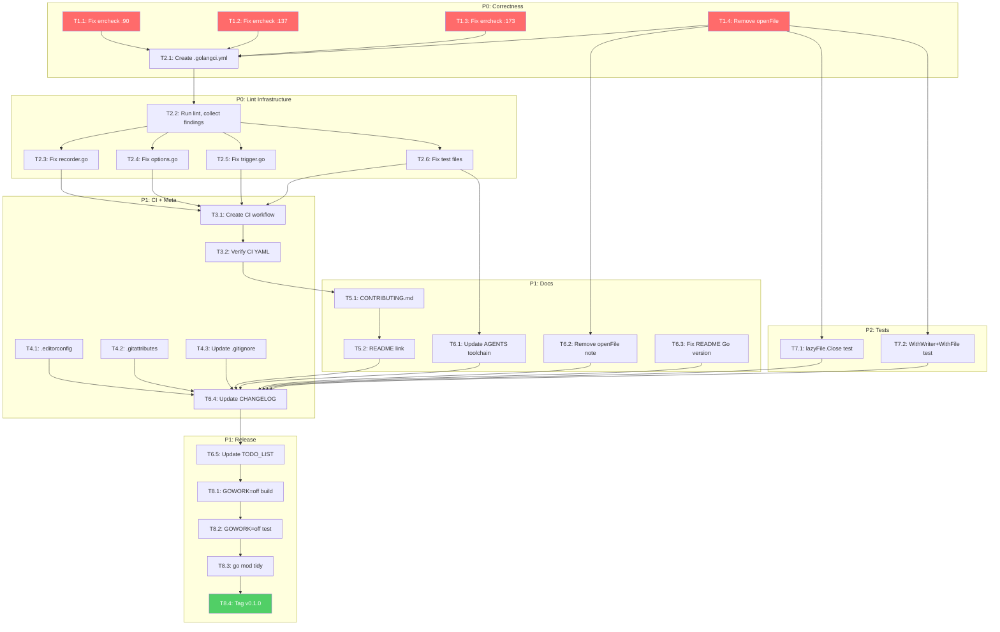

# Planning: go-flightrecorder Production Readiness

**Date:** 2026-08-10 13:53
**Goal:** Bring go-flightrecorder to the same production standard as sibling micro-libraries (go-retry, go-idempotency).

---

## Context

go-flightrecorder was extracted from go-cqrs-lite as a zero-dependency library. The code works (27 tests pass, `go vet` clean), but the project lacks the infrastructure that sibling micro-libraries have established as the pattern. This plan closes that gap.

## Sibling Pattern (established by go-retry and go-idempotency)

| Element         | Pattern                                        | Source                   |
| --------------- | ---------------------------------------------- | ------------------------ |
| Build system    | `go` + `golangci-lint` only — **NO flake.nix** | go-retry CONTRIBUTING.md |
| Lint config     | `.golangci.yml` v2 format, ~90 linters         | go-retry `.golangci.yml` |
| CI              | GitHub Actions: test (race) + vet + lint       | both repos               |
| CONTRIBUTING.md | Dev commands, prerequisites                    | both repos               |
| SECURITY.md     | Supported versions + reporting                 | go-retry                 |
| .editorconfig   | tab for Go, space for YAML/JSON                | go-retry                 |
| .gitattributes  | `* text=auto eol=lf`                           | go-retry                 |
| .gitignore      | buildflow-managed pattern, includes `reports/` | go-retry                 |
| go.mod          | `go 1.26.5`                                    | both repos               |
| CHANGELOG       | Keep a Changelog, real version tags            | go-retry                 |

## Verschlimmbesserung Prevention

**DO NOT do these things — they would make the project WORSE:**

| Risk                                    | Why it's wrong                                                                                                                  |
| --------------------------------------- | ------------------------------------------------------------------------------------------------------------------------------- |
| Create `flake.nix`                      | Sibling pattern explicitly says NO. Adds Nix dependency for zero value on a 4-file stdlib library.                              |
| Change `go.mod` version                 | `go 1.26.5` matches both sibling repos. Can't verify older versions compile.                                                    |
| Create `docs/DOMAIN_LANGUAGE.md`        | Sibling repos don't have it. Padding for a single-package library.                                                              |
| Rewrite working tests                   | Tests pass. Replacing `time.Sleep` risks breaking them. Only ADD new tests.                                                     |
| Add `WithWriter`/`WithFile` validation  | Last-wins is the standard Go options pattern. Adding rejection would surprise users. Already documented in option doc comments. |
| Create SECURITY.md before GitHub remote | go-retry links to GitHub advisories — can't do that without a remote. Defer.                                                    |

---

## Pareto Analysis

### 1% that delivers 51% (Correctness)

Fix the code issues that would immediately fail CI:

- Fix 3 errcheck warnings in tests
- Remove the `openFile` single-caller abstraction (inline in `captureToFile`)

### 4% that delivers 64% (Lint infrastructure)

- Create `.golangci.yml` matching sibling pattern
- Fix all lint issues revealed by running `golangci-lint run ./...`
- This makes the codebase lint-clean and CI-ready

### 20% that delivers 80% (Project infrastructure + docs)

- GitHub Actions CI workflow
- `.editorconfig`, `.gitattributes`, updated `.gitignore`
- `CONTRIBUTING.md`
- Update `AGENTS.md` and `README.md` to reflect actual toolchain
- Update `CHANGELOG.md` and `TODO_LIST.md`

### Other 20% (Polish)

- Edge case tests
- `GOWORK=off` verification
- Tag `v0.1.0`

---

## Phase 1: 30-100 Minute Tasks

| #  | Task                                                                                | Impact   | Effort | Priority | Deps   |
| -- | ----------------------------------------------------------------------------------- | -------- | ------ | -------- | ------ |
| T1 | Fix all code correctness issues (errcheck, openFile removal, gosec nolint)          | Critical | 30min  | P0       | —      |
| T2 | Create `.golangci.yml` and resolve all lint findings                                | Critical | 60min  | P0       | T1     |
| T3 | Create GitHub Actions CI workflow (test+race, vet, lint)                            | High     | 30min  | P1       | T2     |
| T4 | Create project meta files (`.editorconfig`, `.gitattributes`, `.gitignore` update)  | Medium   | 30min  | P1       | —      |
| T5 | Create `CONTRIBUTING.md` matching sibling pattern                                   | Medium   | 30min  | P1       | T2     |
| T6 | Update all documentation (`AGENTS.md`, `README.md`, `CHANGELOG.md`, `TODO_LIST.md`) | High     | 45min  | P1       | T1, T2 |
| T7 | Add edge case tests (lazyFile.Close unopened, WithWriter+WithFile combined)         | Medium   | 30min  | P2       | T1     |
| T8 | Release verification (`GOWORK=off` build+test, `go mod tidy`, tag v0.1.0)           | High     | 30min  | P1       | T1-T7  |

**Total estimated effort:** ~4.5 hours

---

## Phase 2: Max 12 Minute Tasks

### T1: Fix code correctness (4 tasks)

| #    | Task                                                                           | Effort | Deps |
| ---- | ------------------------------------------------------------------------------ | ------ | ---- |
| T1.1 | Fix errcheck: `recorder_test.go:90` — add error check to `r.Start()`           | 2min   | —    |
| T1.2 | Fix errcheck: `recorder_test.go:137` — add error check to `r.Start()`          | 2min   | —    |
| T1.3 | Fix errcheck: `recorder_test.go:173` — add error check to `r.Start()`          | 2min   | —    |
| T1.4 | Remove `openFile`, inline `os.Create` with `//nolint:gosec` in `captureToFile` | 10min  | —    |

### T2: Create .golangci.yml + resolve lint (6 tasks)

| #    | Task                                                                | Effort | Deps |
| ---- | ------------------------------------------------------------------- | ------ | ---- |
| T2.1 | Create `.golangci.yml` from go-retry pattern (trim build-tags)      | 10min  | T1   |
| T2.2 | Run `golangci-lint run ./...` — collect all findings                | 5min   | T2.1 |
| T2.3 | Fix lint findings in `recorder.go` (likely: wrapcheck, godot, etc.) | 12min  | T2.2 |
| T2.4 | Fix lint findings in `options.go`                                   | 12min  | T2.2 |
| T2.5 | Fix lint findings in `trigger.go`                                   | 10min  | T2.2 |
| T2.6 | Fix lint findings in test files                                     | 10min  | T2.2 |

### T3: CI workflow (2 tasks)

| #    | Task                                                          | Effort | Deps |
| ---- | ------------------------------------------------------------- | ------ | ---- |
| T3.1 | Create `.github/workflows/ci.yml` (test+race, vet, lint jobs) | 10min  | T2   |
| T3.2 | Verify CI file is valid YAML, mentally walk through steps     | 2min   | T3.1 |

### T4: Project meta files (3 tasks)

| #    | Task                                     | Effort | Deps |
| ---- | ---------------------------------------- | ------ | ---- |
| T4.1 | Create `.editorconfig` matching go-retry | 5min   | —    |
| T4.2 | Create `.gitattributes`                  | 2min   | —    |
| T4.3 | Update `.gitignore` — add `reports/`     | 5min   | —    |

### T5: CONTRIBUTING.md (2 tasks)

| #    | Task                                                                     | Effort | Deps |
| ---- | ------------------------------------------------------------------------ | ------ | ---- |
| T5.1 | Create `CONTRIBUTING.md` from go-retry pattern, adapted for this library | 12min  | T2   |
| T5.2 | Add `CONTRIBUTING.md` link to `README.md`                                | 2min   | T5.1 |

### T6: Documentation updates (6 tasks)

| #    | Task                                                                        | Effort | Deps  |
| ---- | --------------------------------------------------------------------------- | ------ | ----- |
| T6.1 | Update `AGENTS.md` — replace "no flake.nix" with golangci-lint as toolchain | 10min  | T2    |
| T6.2 | Update `AGENTS.md` — remove openFile duplication note (fixed)               | 3min   | T1    |
| T6.3 | Update `README.md` — fix Go version to match go.mod                         | 3min   | —     |
| T6.4 | Update `CHANGELOG.md` — add all infrastructure additions                    | 10min  | T1-T5 |
| T6.5 | Update `TODO_LIST.md` — remove completed items                              | 5min   | T1-T5 |
| T6.6 | Update `FEATURES.md` if new tests added                                     | 5min   | T7    |

### T7: Edge case tests (2 tasks)

| #    | Task                                                            | Effort | Deps |
| ---- | --------------------------------------------------------------- | ------ | ---- |
| T7.1 | Add test: `lazyFile.Close` when file was never opened (no-op)   | 10min  | T1   |
| T7.2 | Add test: `WithWriter` + `WithFile` combined (last option wins) | 10min  | T1   |

### T8: Release verification (4 tasks)

| #    | Task                              | Effort | Deps      |
| ---- | --------------------------------- | ------ | --------- |
| T8.1 | `GOWORK=off go build ./...`       | 2min   | T1-T7     |
| T8.2 | `GOWORK=off go test ./...`        | 2min   | T1-T7     |
| T8.3 | `go mod tidy` — verify no changes | 2min   | T1-T7     |
| T8.4 | Tag `v0.1.0`                      | 2min   | T8.1-T8.3 |

**Total: 31 tasks, all under 12 minutes each.**

---

## Execution Graph

---

## What This Plan Does NOT Include (and Why)

| Excluded Item                      | Reason                                                                    |
| ---------------------------------- | ------------------------------------------------------------------------- |
| `flake.nix`                        | Sibling pattern says NO. Would add complexity for zero value.             |
| `docs/DOMAIN_LANGUAGE.md`          | Sibling repos don't have it. 4-file library doesn't warrant it.           |
| `SECURITY.md`                      | Links to GitHub advisories — needs a remote first. Defer until published. |
| Rewrite `time.Sleep` tests         | Tests pass. Changing them risks breakage. ROADMAP item.                   |
| Benchmarks                         | Nice to have, not needed for v0.1.0. ROADMAP item.                        |
| Ecosystem wrappers (HTTP, gRPC)    | ROADMAP material — raw ideas, not bounded tasks.                          |
| `WithWriter`/`WithFile` validation | Last-wins is standard Go options pattern. Already documented.             |
| Change `go.mod` version            | Matches sibling repos. Can't verify older versions.                       |
